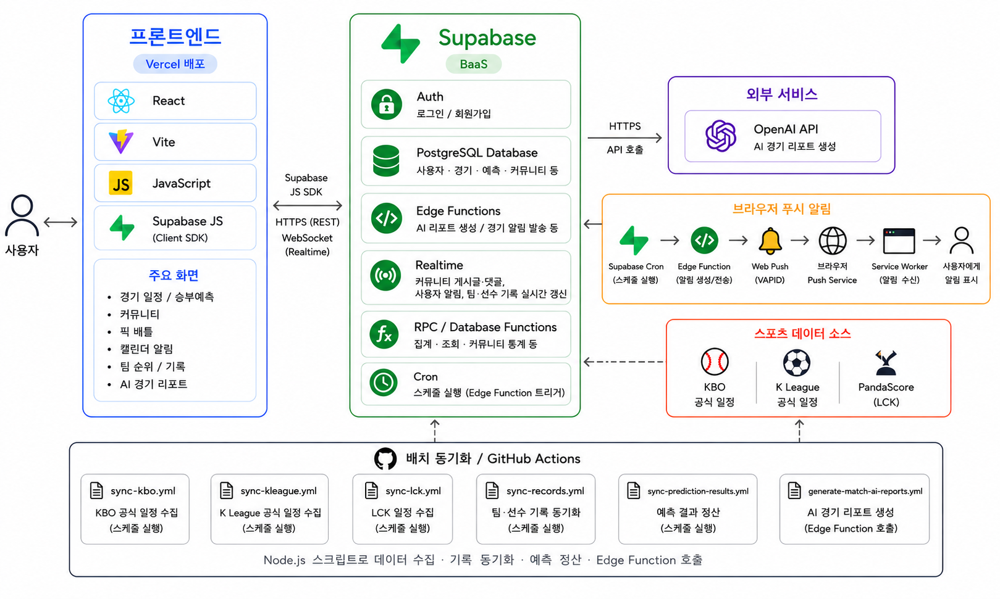
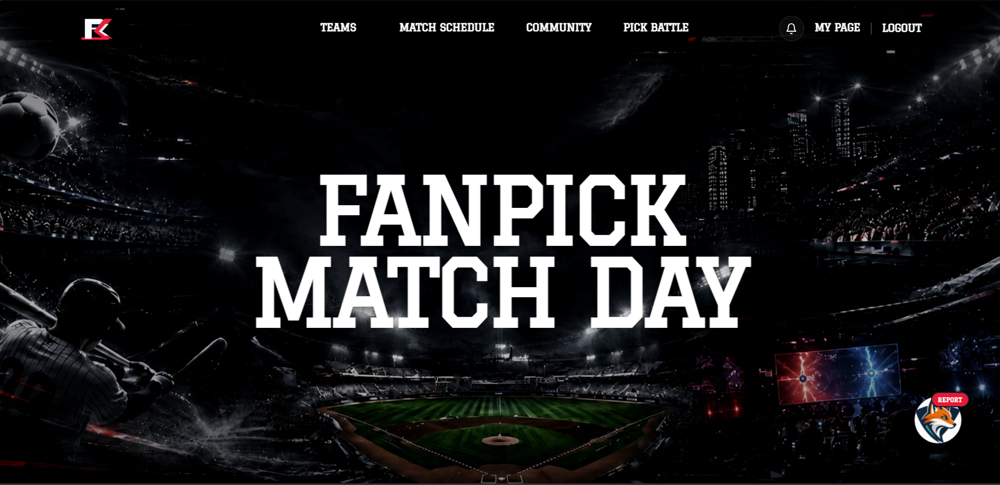

# FanPick

스포츠 경기 일정 및 승부예측 커뮤니티 웹 서비스

---

## Live Demo

[FanPick 바로가기](https://fanpick-fe.vercel.app/)

---

## Introduction

**FanPick**은 사용자가 야구, 축구, e스포츠 경기 일정을 확인하고  
승부예측, 팀 기록 조회, 커뮤니티 활동을 함께 사용할 수 있는 스포츠 팬 웹 서비스입니다.

사용자의 관심 팀, 경기 일정, 예측 데이터를 기반으로  
경기 전후의 팬 경험을 한 곳에서 제공하는 것을 목표로 합니다.

---

## Development Period

2026.07.16 ~ 2026.07.30  
2주간 진행한 미니 프로젝트입니다.

---

## Team

<table>
  <tr>
    <td align="center" width="180px">
      <a href="https://github.com/jun6390">
        
        <br />
        <sub><b>박해준</b></sub>
      </a>
      <br />
      <b>FE</b>
    </td>
    <td align="center" width="180px">
      <a href="https://github.com/kimspace00">
        
        <br />
        <sub><b>김우주</b></sub>
      </a>
      <br />
      <b>FE</b>
    </td>
    <td align="center" width="180px">
      <a href="https://github.com/namuleaf">
        
        <br />
        <sub><b>정승민</b></sub>
      </a>
      <br />
      <b>FE</b>
    </td>
  </tr>
</table>

---

## Tech Stack

<table>
  <tr>
    <th width="120px">Frontend</th>
    <td>
      
      
      
      
    </td>
  </tr>
  <tr>
    <th width="120px">Backend</th>
    <td>
      
    </td>
  </tr>
  <tr>
    <th width="120px">Database</th>
    <td>
      
    </td>
  </tr>
  <tr>
    <th width="120px">API</th>
    <td>
      
      
      
      
    </td>
  </tr>
  <tr>
    <th width="120px">Library</th>
    <td>
      
      
    </td>
  </tr>
  <tr>
    <th width="120px">Deploy</th>
    <td>
      
      
    </td>
  </tr>
</table>

---

## Main Features

### 경기 일정 조회

KBO, K리그, LCK 경기 일정을 조회하고,  
경기 시간, 리그, 팀 정보, 경기 상태를 함께 제공합니다.

사용자는 종목별 경기 목록과 캘린더 화면을 통해  
관심 있는 경기 일정을 빠르게 확인할 수 있습니다.

### 승부예측

사용자가 경기 시작 전 홈팀 또는 원정팀을 선택하여  
승부예측에 참여할 수 있습니다.

예측 참여자 수와 팀별 예측 비율을 제공하고,  
경기 결과에 따라 예측 성공, 실패, 무승부 상태를 확인할 수 있습니다.

### AI 경기 리포트

종료된 경기 데이터를 기반으로 OpenAI API를 활용하여  
경기 요약과 주요 포인트를 생성합니다.

사용자는 최근 경기 결과를 텍스트 리포트 형태로 확인하고,  
팀 기록과 경기 흐름을 빠르게 파악할 수 있습니다.

### 커뮤니티 및 마이페이지

사용자의 승부예측 기록, 예측 뱃지, 관심 팀 정보를 기반으로  
개인화된 마이페이지를 제공합니다.

커뮤니티에서는 게시글 작성, 댓글, 랭킹, 예측 결과 공유를 통해  
팬들이 함께 의견을 나눌 수 있습니다.

---

## Architecture

FanPick은 프론트엔드를 **Vercel**, 백엔드와 데이터베이스를 **Supabase**에 구성했습니다.  
프론트엔드는 사용자와 직접 상호작용하며, Supabase API와 Edge Function을 통해 데이터를 처리합니다.  
GitHub Actions는 KBO, K리그, LCK 경기 일정과 기록 데이터를 동기화하고, AI 리포트와 알림 기능은 Supabase Edge Function을 통해 관리합니다.

<div align="center">
  
</div>

---

## UI Design

### Main Page

FanPick의 메인 화면은 스포츠 경기 정보를 빠르게 탐색할 수 있는 대시보드형 레이아웃으로 제작했습니다.  
상단에는 FanPick 브랜드 배너를 배치하고, 주요 경기와 인기 경기, 승부예측 진입 영역을 구성했습니다.  
사용자는 메인 화면에서 오늘의 경기, 핫 매치, 월드컵 콘텐츠 등 주요 기능으로 이동할 수 있습니다.  
각 섹션은 경기 정보와 팀 로고를 중심으로 구성하여 스포츠 팬이 원하는 정보를 직관적으로 확인할 수 있도록 했습니다.

<div align="center">
  
</div>

<br />

---

## Deployment

| Part     | Platform |
| -------- | -------- |
| Frontend | Vercel   |
| Backend  | Supabase |
| Database | Supabase |

---

## Porting Manual

### 1. 실행 환경

- Node.js 22 이상
- npm
- Supabase 프로젝트
- Vercel 계정
- PandaScore API Key
- OpenAI API Key

### 2. 프로젝트 설치

```bash
git clone https://github.com/ureca-space/fanpick-frontend.git
cd fanpick-frontend
npm install
```

### 3. 환경 변수 설정

루트 경로에 `.env` 파일을 생성하고 아래 값을 설정합니다.

```bash
VITE_SUPABASE_URL=
VITE_SUPABASE_PUBLISHABLE_KEY=
VITE_VAPID_PUBLIC_KEY=
```

경기 데이터 동기화와 AI 리포트 생성 스크립트를 실행하려면  
루트 경로에 `.env.sync` 파일을 추가로 생성합니다.

```bash
SUPABASE_URL=
SUPABASE_SERVER_KEY=
PANDASCORE_API_KEY=
REPORT_FUNCTION_SECRET=
```

AI 리포트 생성 범위를 직접 조정해야 하는 경우에만 아래 값을 선택적으로 추가합니다.  
설정하지 않으면 최근 3일, 최대 30경기를 기본값으로 사용합니다.

```bash
AI_REPORT_LOOKBACK_DAYS=
AI_REPORT_MAX_MATCHES=
```

실제 환경 변수 값은 GitHub에 올리지 않고, 로컬 `.env` 파일과 GitHub Actions Secrets, Vercel Environment Variables에서 관리합니다.

### 4. 로컬 실행

```bash
npm run dev
```

### 5. 빌드 확인

```bash
npm run build
```

빌드 결과는 `dist` 폴더에 생성됩니다.

### 6. Supabase 설정

1. Supabase 프로젝트를 생성합니다.
2. `supabase/migrations`의 SQL을 적용하여 필요한 테이블과 정책을 구성합니다.
3. `supabase/functions`의 Edge Function을 배포합니다.
4. Supabase Edge Function Secrets에 아래 값을 설정합니다.

```bash
OPENAI_API_KEY=
REPORT_FUNCTION_SECRET=
SUPABASE_URL=
SUPABASE_SECRET_KEYS=
```

AI 리포트 생성은 `generate-match-report` Edge Function에서 처리합니다.  
클라이언트는 OpenAI API를 직접 호출하지 않고, 생성된 리포트 데이터를 Supabase DB에서 조회합니다.

### 7. 데이터 동기화

경기 일정, 팀 기록, 순위, 예측 결과는 `scripts` 폴더의 스크립트로 동기화합니다.

```bash
npm run sync:schedules
npm run sync:standings
npm run sync:records
npm run sync:prediction-results
```

AI 리포트는 종료된 경기 중 아직 리포트가 없는 경기만 대상으로 생성합니다.

```bash
node --env-file=.env.sync scripts/generate-match-ai-reports.mjs
```

### 8. GitHub Actions 설정

GitHub Actions에서 자동 동기화와 AI 리포트 생성을 사용하려면  
Repository Secrets에 아래 값을 등록합니다.

```bash
SUPABASE_URL
SUPABASE_SERVER_KEY
VITE_SUPABASE_PUBLISHABLE_KEY
PANDASCORE_API_KEY
REPORT_FUNCTION_SECRET
```

주요 워크플로우는 다음과 같습니다.

- `sync-kbo.yml`: KBO 경기 일정 동기화
- `sync-kleague.yml`: K리그 경기 일정 동기화
- `sync-lck.yml`: LCK 경기 일정 동기화
- `sync-records.yml`: 팀 기록 및 순위 동기화
- `sync-prediction-results.yml`: 승부예측 결과 정산
- `generate-match-ai-reports.yml`: 종료 경기 AI 리포트 생성

### 9. Vercel 배포

Vercel에서 GitHub 저장소를 연결한 뒤 아래 설정을 사용합니다.

| 항목             | 값              |
| ---------------- | --------------- |
| Framework Preset | Vite            |
| Build Command    | `npm run build` |
| Output Directory | `dist`          |

Vercel Environment Variables에는 아래 값을 등록합니다.

```bash
VITE_SUPABASE_URL
VITE_SUPABASE_PUBLISHABLE_KEY
VITE_VAPID_PUBLIC_KEY
```

---

## Folder Structure

<pre>
FANPICK-FE
├── docs
│   └── README Images
├── public
│   ├── logos
│   ├── fanpick_logo.svg
│   ├── fanpick_mascot.svg
│   └── sw.js
├── scripts
│   ├── sync-kbo-schedule.mjs
│   ├── sync-kleague-schedule.mjs
│   ├── sync-lck-schedule.mjs
│   └── generate-match-ai-reports.mjs
├── src
│   ├── assets
│   │   └── images
│   ├── components
│   ├── constants
│   ├── contexts
│   ├── layouts
│   ├── pages
│   │   ├── Calendar
│   │   ├── Community
│   │   ├── Home
│   │   ├── MatchSchedule
│   │   ├── MyPage
│   │   ├── Prediction
│   │   ├── TeamRecord
│   │   ├── Teams
│   │   └── WorldCup
│   ├── routes
│   ├── services
│   ├── utils
│   ├── App.jsx
│   └── main.jsx
├── supabase
│   ├── functions
│   └── migrations
├── index.html
├── package.json
├── vite.config.js
└── README.md
</pre>

---

## Project Summary

FanPick은 단순한 경기 일정 조회 서비스를 넘어  
승부예측, 팀 기록, AI 리포트, 경기 알림, 커뮤니티 기능을 함께 제공하는 스포츠 팬 서비스입니다.

프론트엔드는 React와 Vite 기반으로 구현했으며,  
백엔드와 데이터베이스는 Supabase를 사용하여 인증, 데이터 저장, Edge Function 기능을 구성했습니다.  
서비스는 Vercel과 Supabase를 통해 배포하여 실제 웹 환경에서 사용할 수 있도록 구성했습니다.
